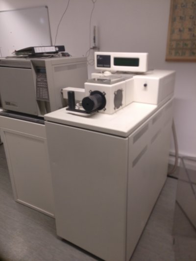
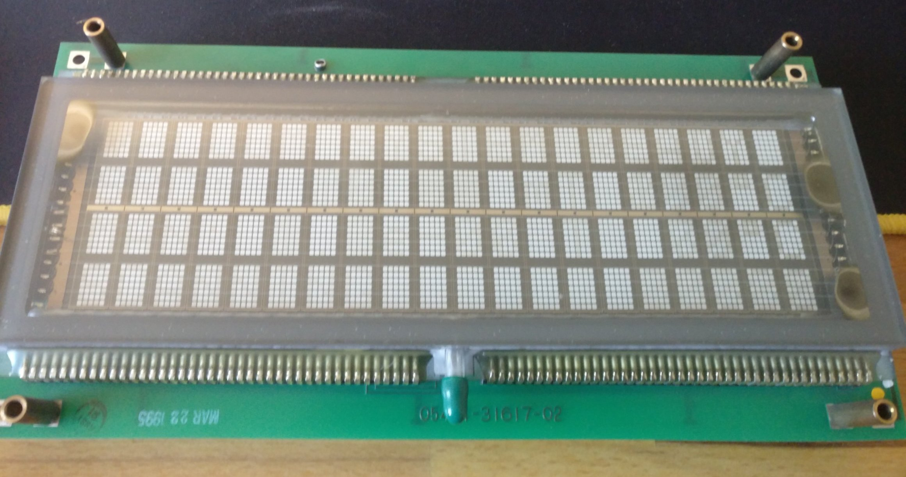
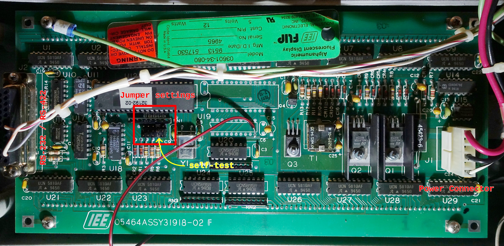

# Project to drive a large vacuum fluorescent display <div name="introduction" />

The display stems from an old Thermo Finnigan Mass Spectrometer (TSQ/SSQ 7000) my university wanted to dispose, so I rescued this cool display.



# Table of contents <div name="toc" />
1. [Introduction](#introduction)
2. [Table of contents](#toc)
3. [Display](#Display)
    1. [Datasheets](#Datasheets)
    2. [Pinout & Jumper](#Pinout)
        1. [RS-232 - 25 pin connector](#25pin)
        2. [power connector - 6 pin connector](#6pin)
        3. [Jumper settings](#Jumper)
    3. [Character set](#Characters)
4. [Microcontroller and connection](#ESP32)
    1. [Hardware used](#hardware)
    2. [Connection](#connection)
    3. [Notes](#notes)

# Display <div name="Display" />
Type: **03601-34-080 FLIP VFD**\
Manufacturer: **IEE**\
**20** characters x **4** rows with a hight of 11.3 mm per character.\
Due to an old version of the manufacturers website the interface is serial and software dimming is available.\
Input voltage **5 V** (12 Watt) -> **2.4 A**



## Datasheets <div name="Datasheets" />
I found no datasheet for exactly this device, however I found some info around the internet:\
 - [datasheet of 03601-30-040R](https://www.farnell.com/datasheets/1681172.pdf) - functionally closest version
 - ["Backup"](https://datasheet.octopart.com/3601-26-240-IEE-datasheet-46887.pdf) of the manufacturers website

## Pinout & Jumper <div name="Pinout" />


### RS-232 - 25 pin connector <div name="25pin" />
According to the datasheet of other serial VFDs of the same manufacturer and of the same time, the inputs are ttl compatible. However, the functionally closest version did not mention this.

[x] - connections present in the GC-MS
```
1  - [ ] Chassis GND\
2  - [x] TX (RS-232C)
3  - [x] RX (RS-232C)
5  - [ ] Clear to Send (RS-232C)
7  - [x] Signal GND
9  - [ ] +10V out
10 - [ ] -10V out
11 - [ ] TX- (RS-422)
15 - [ ] RX- (RS-422)
17 - [ ] RX+ (RS-422)
18 - [ ] TX+ (RS-422)
20 - [ ] Data Terminal Ready (RS-232C)
```
Al other pins are not connected!

### power connector - 6 pin connector <div name="6pin" />

```
1  - +5V
4  - GND
6  - RESET (Pull low to reset)
```
Al other pins are not connected!

### Jumper settings <div name="Jumper" />
The settings were extrapolated from a [datasheet of a S03601-30-040R](https://www.farnell.com/datasheets/1681172.pdf) display
```
E5 -> E10 Burn-In-Test      (no reaction from my display)
E4 -> E9  Self-Test         (works, every character is displayed)
E3 -> E8  Even Parity
E2 -> E7  Disable Parity - 2 Stop Bits
E1 -> E6  From 9600 to 1200 baud
```

<a href="http://www.youtube.com/watch?feature=player_embedded&v=xELaOZ6K31M" target="_blank">
 
</a>

Video of the self-test program.

## Character set <div name="Characters"/>
The display is using ASCII and has has a few alternate character sets which can be selected as shown in the datasheet.


# Microcontroller and connection <div name="ESP32" />

## Hardware used <div name="hardware" />

 - ESP32 nodemcu (AZDelivery)
 - MAX3232 based RS232-TTL adapter
 - DHT22
 - light-sensor
 - RTC DS1307 (needs 5V supply)

## Connection <div name="connection" />

 - Pin 04 -> DHT22 data pin
 - Pin 16 -> RX (MAX3232)
 - Pin 17 -> TX (MAX3232)
 - Pin 33 -> Light sensor
 - Pin 21 -> SDA (RTC)
 - Pin 22 -> SCL (RTC)

## Notes to myself <div name="notes" />

 - Due to bad signaling reasons it was necessary to reduce the baud rate to 1200 between the display and the microcontroller.
 - The display is dimmable, but only in two steps. However, the documentation mentions 4 dimming steps.
 - Disconnect 5V supply from ESP32 before programming